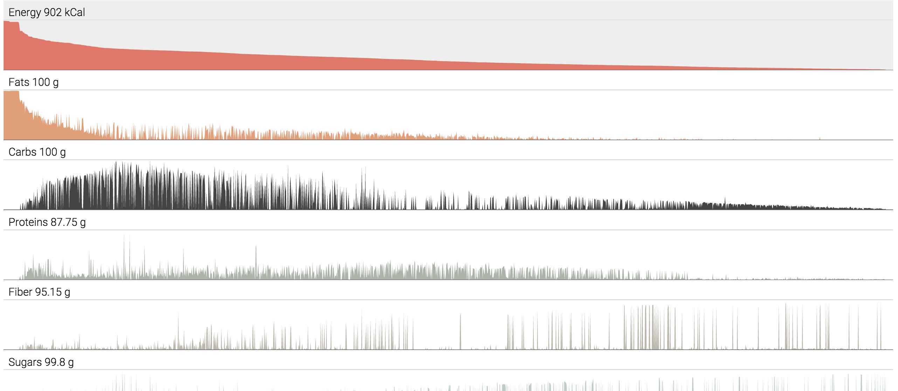
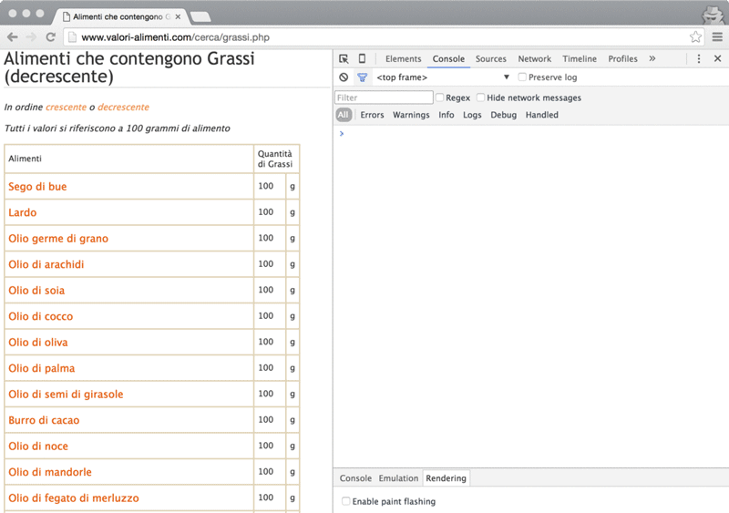

# Scraping data in the kitchen

### or play with the browser in order to do web scraping over valori-alimenti.it



This is the repository for the technical explanation as well as the source files related to the sister article, which describes the motivations behind this work, published on Medium that can be found over [here](http://medium.com)

If you have already read the article, you can go further over the step by step about how to start your web scraping session with your browser. 

Assuming you are using Google Chrome you need to:

- open in a new tab [this](http://www.valori-alimenti.com/cerca/grassi.php) url which is our starting page
- open the Chrome DevTool and the Console tab (ALT+CMD+I)
- open in another tab [this link](http://code.jquery.com/jquery-2.1.4.min.js) in order to grab (copy into the clipboard) the full source of jQuery, then close it
- back to the first tab, paste the full code into the Console window and hit ENTER

Now we have injected jQuery into the original page thus we can exploit it for our purposes.

The starting page shows the complete list of nutrition elements we need to scrape. 
Each element contains also the link to its detail page that we'll cover later.
Copy and paste (and hit ENTER) the following snippet in order to transform that list into a logic javascript array.


```javascript
var arr = []

$('tbody').children().each(function(i, e){
    var td = $(e).children()
    if(td.length == 3){
		var name = $(td[0]).find('a').text();
		var link = $(td[0]).find('a').attr('href');
		arr.push({name:name, link:link})
    }
})

console.log(arr);
```

Here a quick .gif to show the steps in sequence with some highlights:



Now with the complete list we can fetch each page for each element in order to get details for each item. The following snippet is an example about how to do this task.

```javascript
function getItem(item){
	
	$.get(item.link)

	.success(function(data){
		var table = $(data).find('.valori tr').each(function(i, e){
			var td = $(e).children()
			if(td.length == 3){
				var prop_name = $(td[0]).text() + '__' + $(td[1]).text();
				var prop_value = $(td[2]).text();
				item[prop_name] = prop_value;
			}
		})
	})

	.error(function(data){
		console.log('error', data)
	})
}

// example line for test only
var item = {name:'aaa', link:'/nutrizionali/tabella04002.php'}
getItem(item);

```


The above snippet is not actually ready since it needs a way to be called for each item present in the array. 
You can see the additional code in the next one, which is ready to be copied:


```javascript
function getItem(item){
	
	$.get(item.link)

	.success(function(data){
		var current_cat = '';
		var table = $(data).find('.valori tr').each(function(i, e){
			var td = $(e).children()
			if(td.length == 3){
				var name = $(td[0]).text();
				var unit = $(td[1]).text();
				var key = name + '__' + unit;
				var prop_value = $(td[2]).text();
				item[key] = {value: +prop_value, unit:unit, cat:current_cat};
			}else{
				current_cat = $(e).text();
			}
		})

		check();		
	})

	.error(function(data){
		console.log('error', data)
		check();
	})
}

var counter = -1;

function check(){
	if(counter < arr.length-1){
		counter++;
		console.log('getting ', counter);
		getItem( arr[counter] )
	}else{
		console.log('DONE!');
	}
}
check();
```


By doing so the javascript runtime will make a fetch for each item in the array, parse the response in order to decorate the object with all the properties found in the detail page. There are over 1.700 items in the list thus we'll need to fetch for the same amount of time, a bunch of minutes with a regular broadband connection.

Once you'll get the ‘Done!’ message from the console will mean the final dataset, a structured and machine readable version of the informations you can read on the website, will be ready to be used in browser memory.

To move the just cooked dataset outside the browser temporary memory (for instance if you've close the window you would lost the dataset), we simply need to save it in a local file.
The quickest way to do that is to copy the dataset into the system clipboard using the console internal function ```copy(arr)``` where ```arr``` is the variable name we used in the whole process.

The dump of the final dataset is not included into the repository to make it lightweight.

Since json is quite huge (nearly 10Mb), you can convert it as ```csv``` (less than 1Mb) before export in local environment with the following snippet:

```javascript
var csv = '';

for(var k in arr[0]){
	csv += '"' + k + '",'
}
csv+='\n\r';

arr.forEach(function(d, i){
	for(var k in d){
		csv += '"' + d[k] + '",'
	}
	csv+='\n\r';
})

```

Now you can copy your csv source with ```copy(csv);``` and paste it into a blank text file.

## Visualization

At this stage there is a first version of a possible visualization using the dataset just got from the above activity.
You can find the source file inside the ```visualization``` folder or you can view the working version [here](http://bl.ocks.org/abusedmedia/9a5abb33f4d45703c016)
